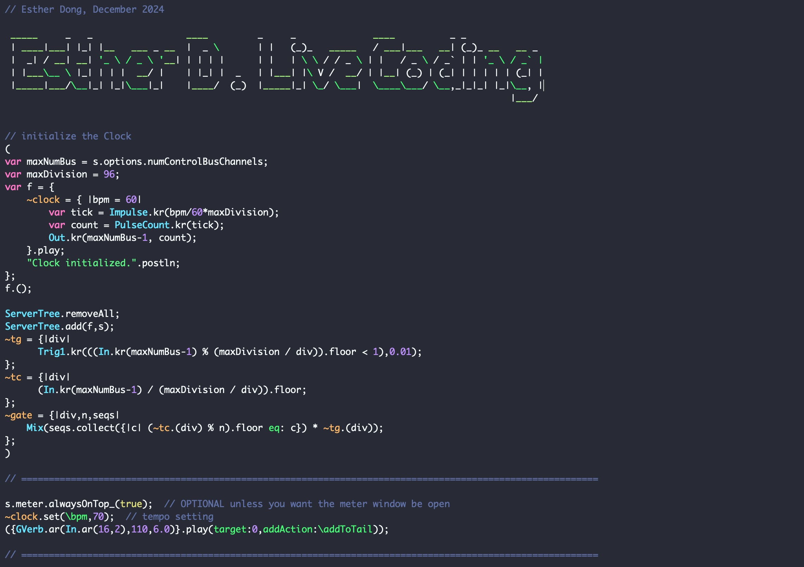

# SuperCollider Live Coding

## Overview

This project is a **live coding performance patch** written in **SuperCollider**, inspired by [[Sungmin Park](https://github.com/byulparan)]. It features a modular approach to generating musical patterns, including bass, arpeggios, pads, leads, and drums, synchronized via a custom clock system. The project is designed to showcase creative sound design and live coding workflows for experimental and performance purposes.


## Features

- **Custom Clock System**: 
  - A flexible clock mechanism (`~clock`) to synchronize all sound modules with adjustable tempo.
  - Control signal triggers (`~tg`) and counters (`~tc`) for rhythm generation.

- **Modular Components**:
  - **Bass 1 and Bass 2**: Provides low-end presence with varying rhythmic and harmonic structures.
  - **Arpeggiator**: Dynamic arpeggios with parameterized randomness.
  - **Pad**: Harmonic textures with slow envelopes and evolving chords.
  - **Lead**: Expressive melodies using lag and variable pitch movement.
  - **Drums**: Custom percussive elements (kick, snare, hi-hats) with envelope shaping.

- **Effects**:
  - Integrated **reverb** for spatial depth.
  - **Panning** and stereo imaging for enhanced soundstage.

## Demo Video


[](https://youtu.be/qJnYyId9GHc)

> *Click the image to watch the video on YouTube.*

## Getting Started

### Prerequisites

- Install [SuperCollider](https://supercollider.github.io/) (version 3.12 or later is recommended).
- Basic understanding of live coding in SuperCollider.

### Installation

1. Clone or download this repository:
   ```bash
   git clone https://github.com/estherdongg/supercollider-live-coding.git
   cd supercollider-live-coding
   ```
2. Open the code in SuperCollider.

### Usage

1. **Initialize the Clock System**:
   - Run the clock initialization code to start the global clock:
     ```supercollider
     (
     var maxNumBus = s.options.numControlBusChannels;
     var maxDivision = 96;
     var f = {
         ~clock = { |bpm = 60|
             var tick = Impulse.kr(bpm/60*maxDivision);
             var count = PulseCount.kr(tick);
             Out.kr(maxNumBus-1, count);
         }.play;
         "Clock initialized.".postln;
     };
     f.();
     ServerTree.removeAll;
     ServerTree.add(f, s);
     ~tg = {|div| Trig1.kr(((In.kr(maxNumBus-1) % (maxDivision / div)).floor < 1), 0.01); };
     ~tc = {|div| (In.kr(maxNumBus-1) / (maxDivision / div)).floor; };
     ~gate = {|div, n, seqs| Mix(seqs.collect({|c| (~tc.(div) % n).floor eq: c}) * ~tg.(div)); };
     )
     ```

2. **Set BPM**:
   - Adjust the tempo of the clock:
     ```supercollider
     ~clock.set(\bpm, 70);
     ```

3. **Play Each Component**:
   - Run the code for any sound module (e.g., `bass1`, `bass2`, `arp`, `pad`, `lead`, `drums`) individually or together:
     ```supercollider
     Ndef(\bass1).play;
     Ndef(\arp).play;
     ```

4. **Apply Effects**:
   - Start reverb processing:
     ```supercollider
     ({GVerb.ar(In.ar(16, 2), 110, 6.0)}.play(target: 0, addAction: \addToTail));
     ```

5. **Release Components**:
   - Fade out and release specific modules:
     ```supercollider
     Ndef(\bass1).fadeTime_(5).release;
     ```


## Customization

### Parameters to Edit for Fun
- **BPM**: Change the tempo dynamically:
  ```supercollider
  ~clock.set(\bpm, 120);
  ```
- **Fade Time**: Adjust the fade time for smooth transitions:
  ```supercollider
  Ndef(\bass1).fadeTime_(10);
  ```
- **Notes and Chords**: Modify pitch or chord progressions:
  ```supercollider
  var note = TChoose.kr(gate, [40, 44, 48, 52, 56]);
  ```
- **Effects**: Add or adjust effects like reverb or distortion.


## About Author

**[Esther Dong](https://estherdongg.github.io/)**  

Musician, composer, and sound artist based in Boston.


## Credits

This project was inspired by an [example](https://youtu.be/P9QaPtrPJbs?si=hnfgkSgpY6U5bWDl) by **[[Sungmin Park](https://youtube.com/@sungminpark?si=FhgQUVAWrwmJTJcQ)]** on YouTube. The original work provided foundational ideas for the clock and modular sound design techniques, which were extended and adapted in this patch. Thank you for the inspiration!

⚠️ If you would like to share or use this code in your own projects, please make sure to credit the original author, Sungmin Park, and his [YouTube tutorial](https://www.youtube.com/watch?v=P9QaPtrPJbs&list=PLhikuBfSBGZDhijcDguuco6fFp2q5UJgi&index=4).
